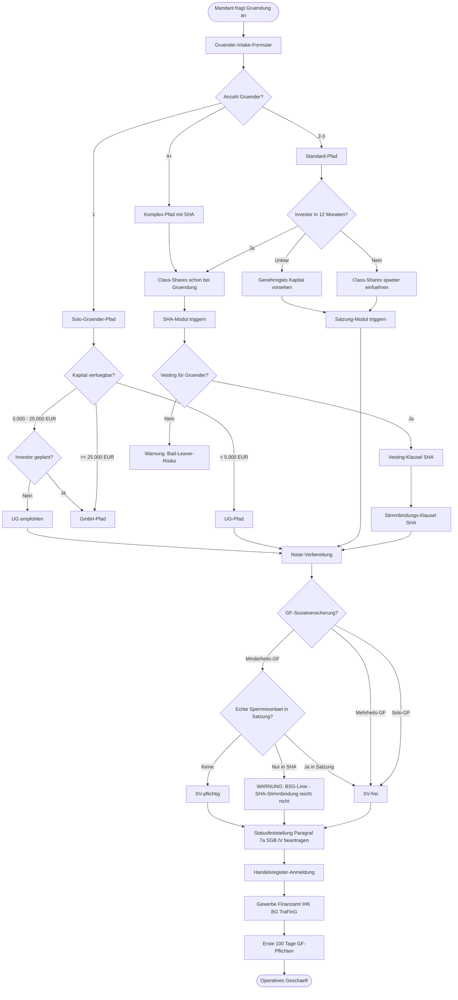
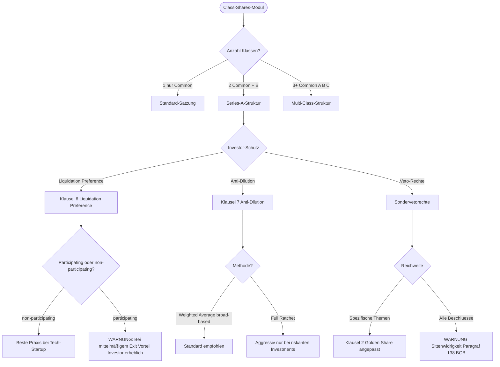
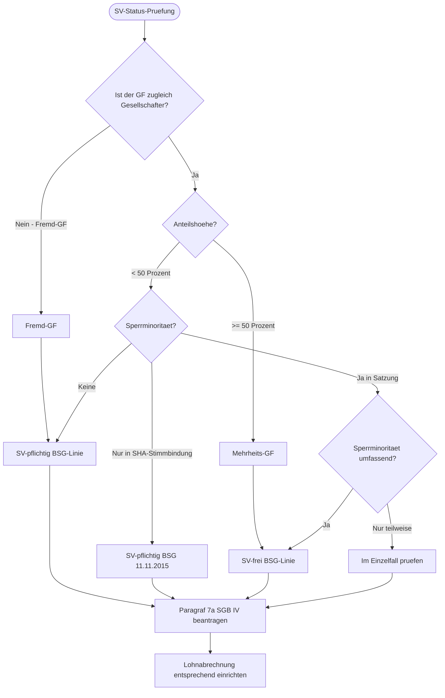
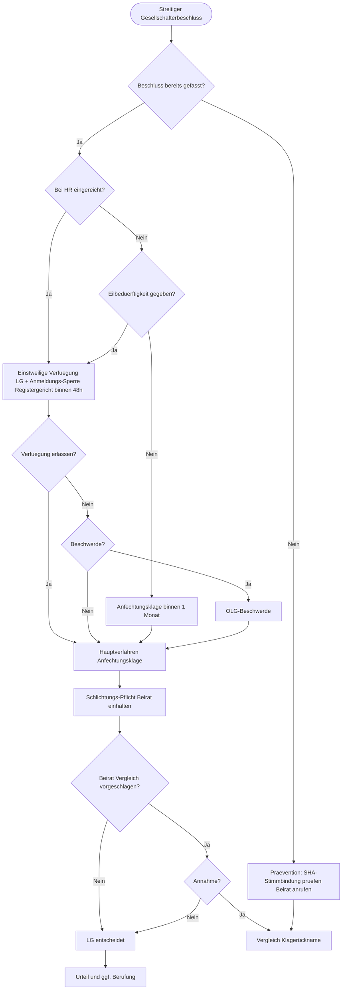

# 1. Intake-Diagramme

Die Diagramme visualisieren den bereits erhobenen Gründungsfall. Sie werden nur geöffnet, wenn eine grafische Entscheidungsdarstellung benötigt wird.

## Gesamt(Mermaid)

## Detail-Diagramm: Class-Shares-Modul

## Detail-Diagramm: SV-Status-Prüfung

## Detail-Diagramm: Streit-Eskalations-Pfad

